# SkyRoute

**AI-powered helicopter logistics optimization — constraint programming meets machine learning for real-time fleet scheduling.**


> **Source code is private.** This repository showcases the project's architecture, features, and screenshots.
> For access, demos, or collaboration — reach out via my portfolio.

### [techayush.pro](https://techayush.pro)

---

## The Problem

Scheduling helicopters across remote locations is a hard combinatorial optimization problem. Every day, multiple clients submit transport demands — passengers and cargo that need to move between hubs and remote sites. A human scheduler has to juggle:

- **3 helicopters** with different home bases and allowed routes
- **19 locations** (3 hubs + 16 remote sites)
- **Daily fatigue limits** — no helicopter can fly more than 6 hours/day
- **Fleet hour budgets** — each zone has a fixed allocation for the entire operational period
- **Priority demands** — Critical requests must be scheduled before Routine ones
- **Weather closures** — bad weather cancels flights and triggers automatic rescheduling
- **Deadhead flights** — helicopters need repositioning legs between non-adjacent demands
- **Weight constraints** — every flight must carry exactly 400kg (passengers + cargo)

Manual scheduling breaks down fast. SkyRoute automates the entire pipeline.

---

## The Solution

SkyRoute replaces manual scheduling with an AI-driven pipeline that handles the full operational lifecycle:

```
Client submits demand
       ↓
Admin reviews & approves
       ↓
OR-Tools CP-SAT optimizer assigns flights to helicopters
       ↓
Schedule published (with auto-inserted ferry flights)
       ↓
Flights executed → Actuals recorded
       ↓
ML models learn from outcomes → Better future scheduling
```

---

## Screenshots

<table>
<tr>
<td width="50%">

**Login**


</td>
<td width="50%">

**Admin Dashboard**
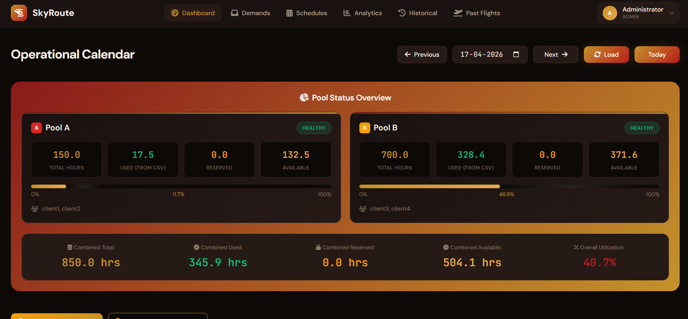

</td>
</tr>
<tr>
<td width="50%">

**Create Demand**
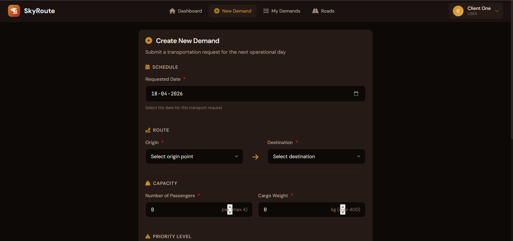

</td>
<td width="50%">

**Demand List — All Statuses**
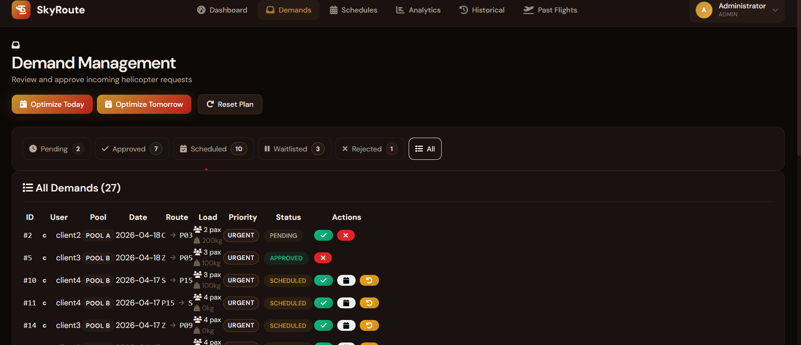

</td>
</tr>
<tr>
<td width="50%">

**Run Optimization**
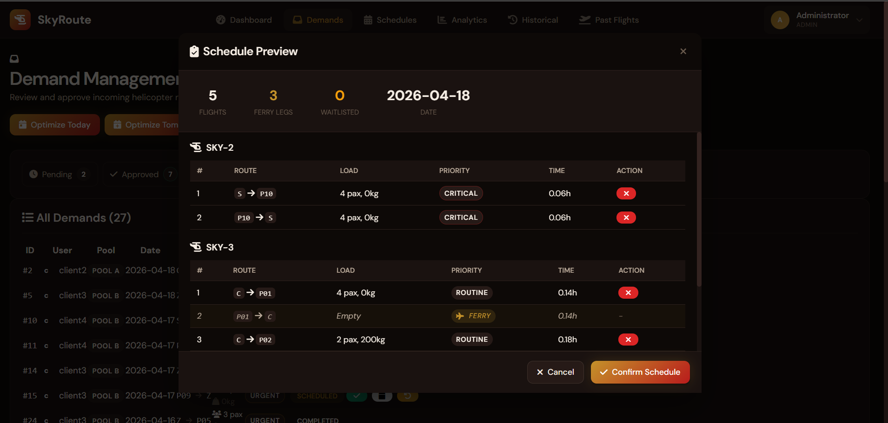

</td>
<td width="50%">

**Optimized Schedule**
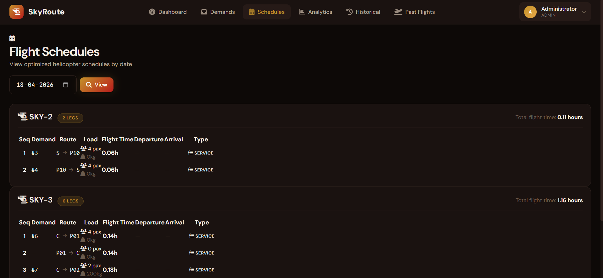

</td>
</tr>
<tr>
<td width="50%">

**Optimization Report**
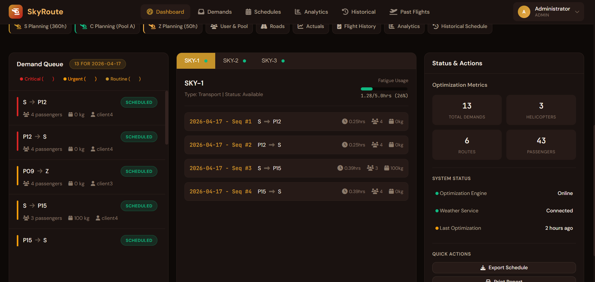

</td>
<td width="50%">

**Historical Analytics**
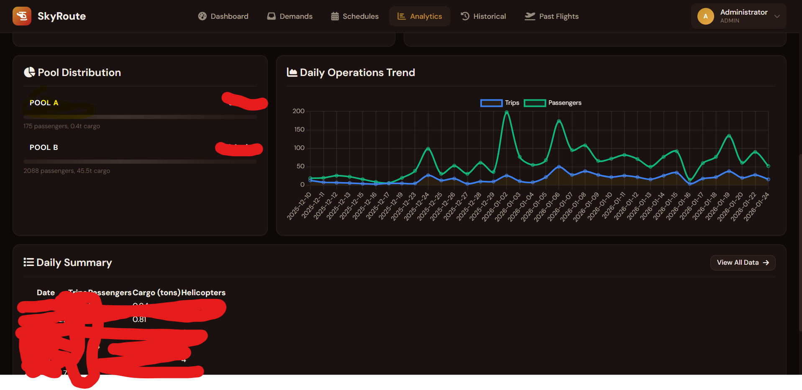

</td>
</tr>
<tr>
<td width="50%">

**AI Schedule Planning**
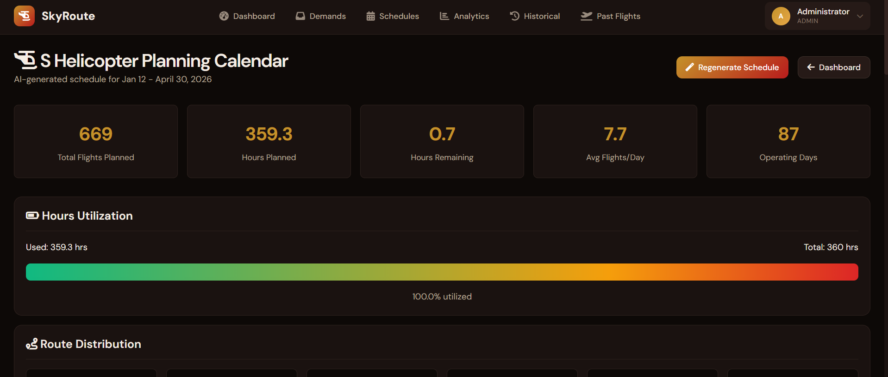

</td>
<td width="50%">

**Weather Management**
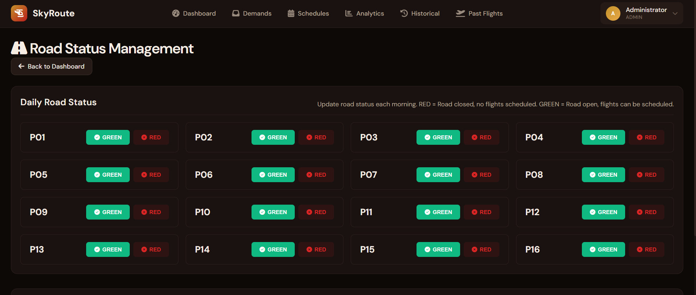

</td>
</tr>
<tr>
<td width="50%">

**Flight Actuals Entry**
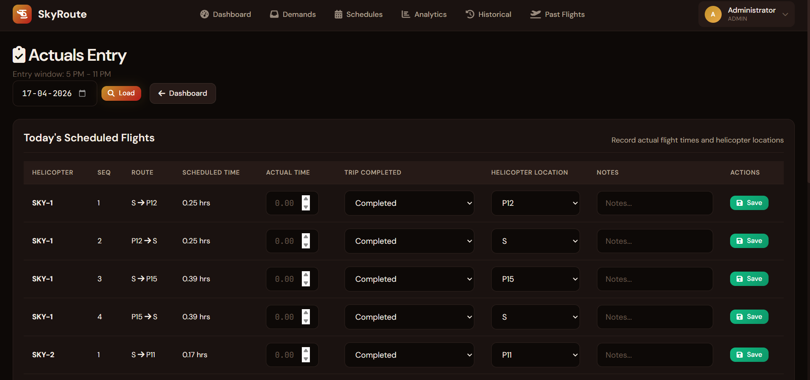

</td>
<td width="50%">

**Client Dashboard**
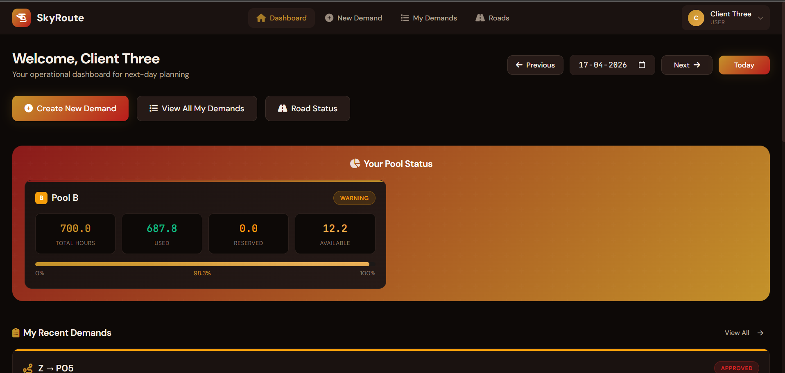

</td>
</tr>
</table>

---

## How the Optimizer Works

The core engine uses **Google OR-Tools CP-SAT** (Constraint Programming — Satisfiability), an integer linear programming solver built for scheduling problems.

### Decision Variables

For every combination of `(demand, helicopter, position)`, a binary variable decides: is this demand assigned here?

### Constraints

| # | Constraint | What It Enforces |
|---|-----------|------------------|
| 1 | **Assignment** | Each demand is assigned to at most one helicopter |
| 2 | **Slot uniqueness** | At most one demand per helicopter per time slot |
| 3 | **Pool hours** | Total flight hours per zone cannot exceed the daily budget |
| 4 | **Fatigue limit** | No helicopter flies more than 6 hours/day (including deadheads) |
| 5 | **Node restriction** | Each helicopter can only serve its assigned set of locations |
| 6 | **Weather** | No flights to/from weather-closed bases |
| 7 | **Road status** | No flights to sites with closed road access |

### Objective Function

```
Maximize:
    Σ (base_weight × assignment)
  + priority_bonuses (Critical: 1M, Urgent: 100K, Routine: 10K)
  - deadhead_penalties
  - load_imbalance_penalties
```

This ensures Critical demands are always prioritized, deadhead flights are minimized, and workload is balanced across helicopters.

### Post-Processing

After the solver runs:
1. **Greedy chaining** — reorder flights to minimize repositioning distance
2. **Deadhead insertion** — add ferry legs where helicopters need to reposition
3. **Load balancing** — redistribute flights across same-base helicopters
4. **Return-to-base** — ensure every helicopter ends the day at home

If the CP-SAT solver can't find a solution (infeasible or timeout), a **greedy fallback** algorithm takes over — assigning demands one by one in priority order to the helicopter with the most remaining capacity.

---

## Machine Learning Pipeline

SkyRoute includes 4 ML components that learn from historical operations and improve scheduling over time:

### Route Scorer
- **Model**: Random Forest Regressor (50 estimators)
- **Input**: 8-feature vector — route popularity, node busyness, distance category, day-of-week, pool usage, priority encoding, shuttle flag
- **Output**: Route efficiency score (0–100)
- **Online learning**: Model updates after each optimization run with warm-start training
- **Purpose**: Helps the optimizer prioritize historically efficient routes

### Demand Forecaster
- **Model**: Time-series statistical model (mean + linear trend + noise)
- **Trained per region**: Separate model for each of the 4 client regions
- **Output**: Predicted daily demand volume for the next 7 days
- **Purpose**: Anticipate peak demand days for proactive planning

### AI Explainer
- Generates human-readable explanations for why each demand was scheduled or waitlisted
- Analyzes constraint violations: "Waitlisted due to helicopter fatigue limit" or "Pool B budget exceeded"
- Provides actionable recommendations

### Feature Engineering
- Extracts 8 normalized features from historical CSV data
- Route frequency maps (how often each route is used)
- Node busyness scores (how active each location is)
- Pool usage patterns (average, min, max hours per pool)

---

## Architecture

```
┌──────────────────────────────────────────────────────────────┐
│                         FRONTEND                             │
│   Vanilla JS · Chart.js · Dark Theme CSS · Role-Based Views  │
└───────────────────────────┬──────────────────────────────────┘
                            │
┌───────────────────────────▼──────────────────────────────────┐
│                        FLASK APP                             │
│   ~30 API endpoints · Session Auth · Jinja2 Templates        │
├──────────────┬────────────────┬───────────────────────────────┤
│  OPTIMIZER   │  ML PIPELINE   │       DATA LAYER              │
│  OR-Tools    │  Route Scorer  │  SQLite (19 tables)           │
│  CP-SAT      │  Forecaster    │  CSV Import/Export            │
│  Greedy      │  Explainer     │  Distance Matrix              │
│  Fallback    │  Features      │  Pool Usage Fusion            │
└──────────────┴────────────────┴───────────────────────────────┘
```

### Data Flow

```
CSV Historical Data ───┐
                       ├──→ Pool Usage (fused) ──→ Optimizer Constraints
Database Flights ──────┘

Approved Demands ──→ OR-Tools CP-SAT ──→ Schedule ──→ Database
                          │                    │
                     ML Route Scores      Deadhead Insertion
                          │                    │
                     Priority Weights     Load Balancing
```

---

## Network Topology

```
           Hub C (Central)                Hub Z (Zone)
            ╱  │  ╲                       ╱  │  ╲
          P01 P02 P03 P04             P05 P06 P07 P08 P09
          ───── Zone A ─────          ───────── Zone B (Z) ─────────
          SKY-3 (shared)                    SKY-3 (shared)

                               Hub S (South)
                            ╱  │  │  │  │  │  ╲
                         P10 P11 P12 P13 P14 P15 P16
                         ───────── Zone B (S) ─────────
                            SKY-1    SKY-2
```

| Component | Details |
|-----------|---------|
| **Hubs** | 3 — Central (C), Zone (Z), South (S) |
| **Remote Sites** | 16 — P01 through P16 |
| **Helicopters** | 3 — SKY-1 & SKY-2 (Hub S), SKY-3 (shared Hub C/Z) |
| **Fleet Zones** | Zone A: 150h budget (clients 1–2), Zone B: 700h budget (clients 3–4) |

---

## Features

### Demand Management
- Clients create transport requests with route, passenger count, cargo weight, and priority level
- Weight constraint enforcement: every flight must total exactly 400kg
- Full lifecycle tracking: Pending → Approved → Scheduled → Completed
- Waitlisted demands can be rescheduled to the next day or cancelled by the client

### Schedule Optimization
- One-click optimization via admin dashboard
- Preview mode: see results before confirming
- Date-aware: before 2 PM optimizes today, after 2 PM optimizes tomorrow
- Force-schedule: manually assign high-priority demands to specific helicopters
- Handles multiple planning systems: S-Planning (AI-generated), C-Planning, Z-Planning

### Weather & Operations
- Time-gated weather marking (5–11 PM operational window)
- Bad weather auto-cancels affected flights and reschedules demands to next day
- Road status system: mark routes open/closed, optimizer skips closed routes
- Flight actuals entry: record real flight hours, mark trips complete or reschedule incomplete ones

### Analytics & History
- Chart.js dashboards: route distribution, daily trends, pool utilization
- Historical data import from CSV with automatic date normalization
- Pool hour tracking: fused from CSV archives + database flights
- Nightly archival of past schedules with APScheduler

### Access Control
- 5 roles: 1 admin + 4 client accounts
- Each client sees only their assigned pool, nodes, and helicopters
- Admin has full access: approve demands, run optimizer, manage weather, view all analytics

---

## Tech Stack

| Layer | Technology | Purpose |
|-------|-----------|---------|
| **Optimization** | Google OR-Tools CP-SAT | Constraint-based flight scheduling |
| **Machine Learning** | scikit-learn, pandas, numpy | Route scoring, demand forecasting, feature extraction |
| **Backend** | Flask 3.0, SQLite | REST API, session auth, 19-table schema |
| **Frontend** | Vanilla JS, Chart.js 4.4 | Interactive dashboard, charts, form validation |
| **Scheduling** | APScheduler | Nightly pool refresh at midnight |
| **Monitoring** | Sentry (optional) | Production error tracking |

---

## Database Design

19 tables organized across 5 domains:

| Domain | Tables | Purpose |
|--------|--------|---------|
| **Core** | `demands`, `schedules`, `nodes`, `distance_matrix` | Demand lifecycle, flight scheduling, geographic data |
| **Planning** | `c_planned_schedule`, `z_planned_schedule`, `s_planned_schedule`, `planning_days`, `planned_flights` | Long-term hub-specific schedule planning |
| **Operations** | `flight_actuals`, `historical_schedules`, `historical_operations`, `pool_usage` | Execution tracking, archival, hour accounting |
| **ML** | `demand_forecasts`, `ml_model_metadata`, `optimizer_runs` | Model metadata, training audit trail |
| **Config** | `weather_events`, `road_status`, `user_allocations` | Operational constraints and access control |

---

## Project Stats

| Metric | Value |
|--------|-------|
| Total Python LOC | ~10,000 |
| Flask Routes | ~30 |
| HTML Templates | 25 |
| JavaScript Modules | 6 |
| CSS Files | 10 |
| Database Tables | 19 |
| ML Models | 4 |
| Constraint Types | 7 |

---

## Contact

**Source code is private.** For demos, access, or collaboration:

### [techayush.pro](https://techayush.pro)

Built by **[Aayush](https://github.com/Ayushyaverma)**
